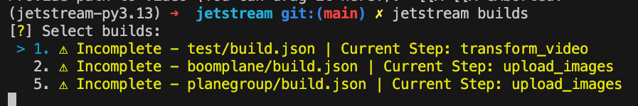

# Builds

There are times where you may accidently close out of your terminal, get rate-limited by Roblox, or moderated.

This is where Jetstream Builds come in handy. Your progress is saved while each Jetstream process is happening so you can continue where you left off.

Run the following command to view all incomplete builds:

```sh
jetstream builds
```

You will then be able to select which incomplete build you would like to continue.



Press enter and the build will continue where it left off.