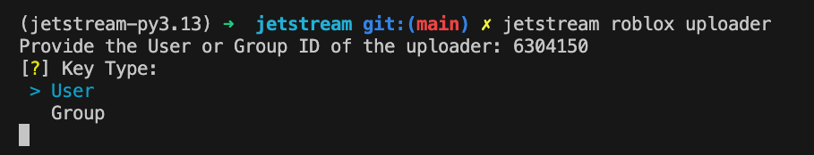

# Setup API Key and Uploader

Now that Jetstream is installed, it’s time to prepare your settings to create projects and upload them to Roblox.

---

## Roblox API Key

To publish assets to Roblox we will need to use Roblox's Open Cloud API meaning you will need to input an API key to Jetstream.

**This can be done with either a user or a group (If its a user I recommend creating an alternate account as it will heavily trash your dashboard with frames)**

Start by going to [Roblox Creator Dashboard's API Keys](https://create.roblox.com/dashboard/credentials?activeTab=ApiKeysTab)


Click the `Create API Key` button

You can put any name for your API key (or "Jetstream" to better differentiate from others)


### Granting the Key Permissions

Ensure that when creating your API key, you grant it the **`assets`** system.

Next, grant access to the **`asset:read`** and **`asset:write`** operations.


### Ensuring IP Protection!

Now you will need to ensure Jetstream can use your API key by granting IP permissions.

You may try and find your computer's IP to better secure your API key but it will not be covered in this tutorial. _(Recommended if its your personal account or a group key)_

If you want to keep it simple just add `0.0.0.0/0` as an IP address. (Like image below)


### Create your key

Once you are ready, press the `Save & Generate Key` button.

Your API key will appear at the bottom, click the `Copy Key to Clipboard`

!!! warning
    Be careful, as soon as you exit the creation screen you won't be able to copy your key again and will need to remake the key.


Keep that key in your clipboard! You will need it next.

### Adding your API Key to Jetstream

Now that you have your API key, lets add it to Jetstream.

Run the following command with Jetstream:

```sh
jetstream roblox set
```
It will then prompt your key:

```
Enter Key:
```

Paste your key in and it should return a success message.

### Test your API Key

Jetstream has a command to make sure that the key you entered is working correctly.

Just run this command and it will test the key:

```sh
jetstream roblox test
```

It should return the following if it works correctly:

```
🚀 Jetstream Key Test

User found!

Id: 501780776
Username: imacodr
Link: https://roblox.com/users/501780776
```

---

## Uploader

It was quite a lot for our API key, but don’t worry, you’re done with that now. :smiley:

Now its time for us to set the uploader for our frames. This will depend on which type of key you made.

=== "User API Key"
    If you made an API key using an user, either your personal account or an alternative one. You will use that user's ID.

    Go to your Roblox Profile and look in the URL.

    

    The user ID is between `/users/` and `/profile`

    Copy that ID and run the following Jetstream command:

    ```sh
    jetstream roblox uploader
    ```
    
    It will prompt you to enter the User ID:

    ```
    Provide the User or Group ID of the uploader: 
    ```
    Paste the User ID and press enter.

    Now when prompted for Key Type choose `User`

    

=== "Group API Key"
    If you made an API key using a group, the uploader will be the group's ID.

    Go to your group page and look in the URL.

    

    The group ID is between `/communities/` and `/Group-Name`

    Copy that ID and run the following Jetstream command:

    ```sh
    jetstream roblox uploader
    ```
    
    It will prompt you to enter the Group ID:

    ```
    Provide the User or Group ID of the uploader: 
    ```
    Paste the Group ID and press enter.

    Now when prompted for Key Type choose `Group`

    

---

:white_check_mark: You are now done setting up the API Key and the Uploader